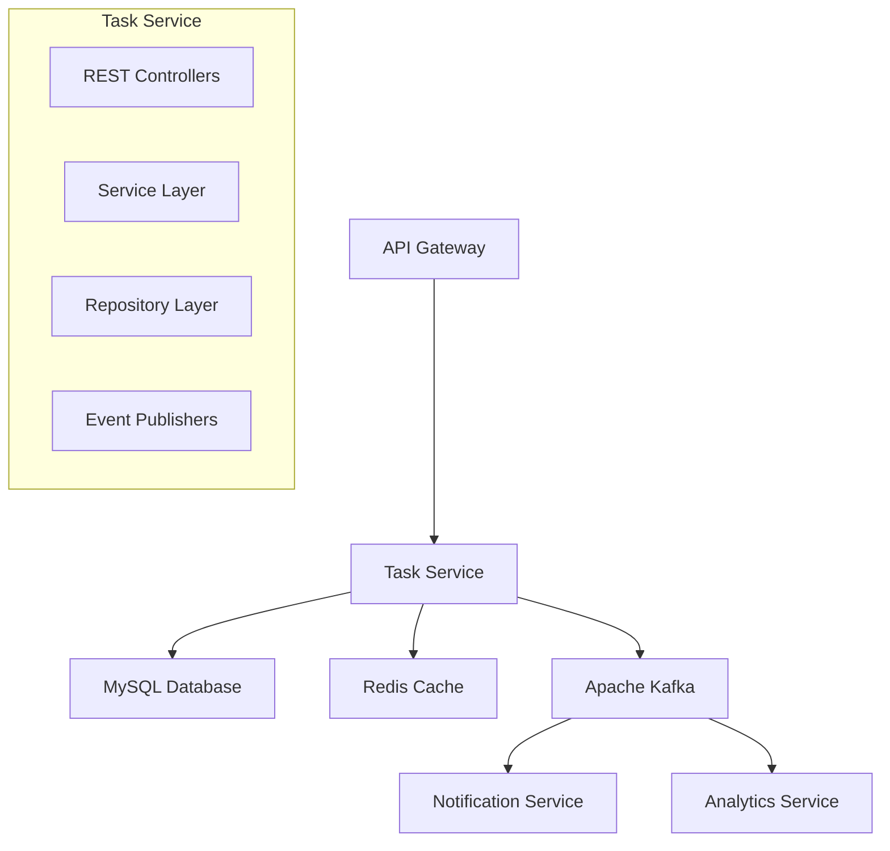
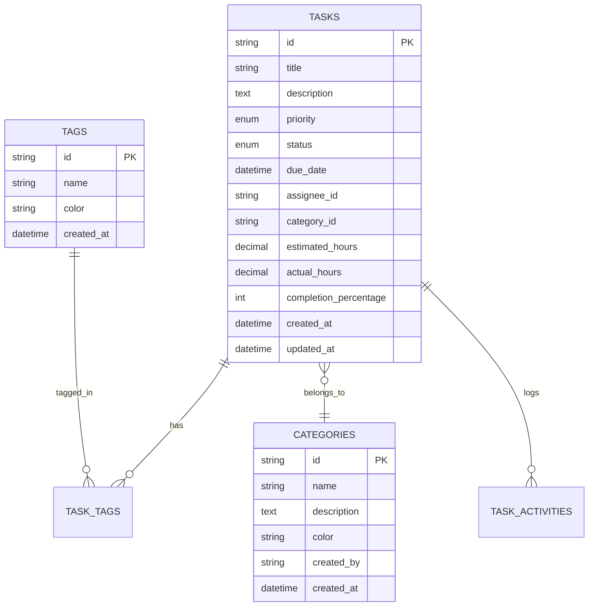

# Task Service

[](https://github.com/your-org/task-service/actions)
[](https://codecov.io/gh/your-org/task-service)
[](https://github.com/your-org/task-service/releases)
[](LICENSE)
[](https://openjdk.java.net/projects/jdk/17/)
[](https://spring.io/projects/spring-boot)

> A comprehensive microservice for task management operations, providing CRUD operations, advanced filtering, categorization, and real-time collaboration features.

## Table of Contents

- [Overview](#overview)
- [Features](#features)
- [Architecture](#architecture)
- [Getting Started](#getting-started)
- [API Documentation](#api-documentation)
- [Configuration](#configuration)
- [Database Schema](#database-schema)
- [Testing](#testing)
- [Deployment](#deployment)
- [Monitoring](#monitoring)
- [Contributing](#contributing)
- [License](#license)

## Overview

The Task Service is a core microservice in our task management platform, built with Spring Boot and designed for scalability and performance. It handles all task-related operations including creation, updates, assignment, and analytics.

### Key Capabilities

- **Task Management**: Complete CRUD operations with advanced filtering
- **Collaboration**: Task assignment and real-time updates
- **Analytics**: Performance metrics and productivity insights
- **Integration**: Event-driven architecture with Kafka
- **Performance**: Redis caching and optimized database queries

## Features

- ✅ **Task CRUD Operations** - Create, read, update, and delete tasks
- 🏷️ **Categorization & Tagging** - Organize tasks with categories and tags
- 📊 **Priority & Status Management** - Flexible priority and status tracking
- 📅 **Due Date Tracking** - Deadline management with notifications
- 👥 **Assignment & Collaboration** - Multi-user task assignment
- 📈 **Analytics & Reporting** - Task metrics and productivity insights
- 🔔 **Event-Driven Architecture** - Real-time updates via Kafka events
- ⚡ **High Performance** - Redis caching and optimized queries
- 🔍 **Advanced Filtering** - Complex search and filter capabilities
- 📝 **Activity Logging** - Complete audit trail for all actions

## Architecture



### Technology Stack

- **Framework**: Spring Boot 3.x
- **Language**: Java 17+
- **Database**: MySQL 8.0+
- **Cache**: Redis 6.0+
- **Messaging**: Apache Kafka
- **Service Discovery**: Eureka
- **Documentation**: OpenAPI/Swagger
- **Testing**: JUnit 5, Testcontainers

## Getting Started

### Prerequisites

Before running the Task Service, ensure you have:

- Java 17 or higher
- Maven 3.8+
- MySQL 8.0+
- Redis 6.0+ (optional)
- Docker (recommended)

### Quick Start with Docker

1. **Clone the repository**
   ```bash
   git clone https://github.com/sapunethmini/TaskMaster-TaskService.git
   cd task-service
   ```

2. **Start dependencies**
   ```bash
   docker-compose up -d mysql redis kafka
   ```

3. **Run the application**
   ```bash
   mvn spring-boot:run
   ```

4. **Verify installation**
   ```bash
   curl http://localhost:8082/actuator/health
   ```

### Docker Compose Setup

```yaml
version: '3.8'
services:
  mysql:
    image: mysql:8.0
    environment:
      MYSQL_DATABASE: taskdb
      MYSQL_USER: admin
      MYSQL_PASSWORD: password
      MYSQL_ROOT_PASSWORD: rootpassword
    ports:
      - "3306:3306"
    volumes:
      - mysql_data:/var/lib/mysql

  redis:
    image: redis:6.2-alpine
    ports:
      - "6379:6379"

  kafka:
    image: confluentinc/cp-kafka:latest
    environment:
      KAFKA_ZOOKEEPER_CONNECT: zookeeper:2181
      KAFKA_ADVERTISED_LISTENERS: PLAINTEXT://localhost:9092
    ports:
      - "9092:9092"

volumes:
  mysql_data:
```

### Local Development

1. **Install dependencies**
   ```bash
   mvn clean install
   ```

2. **Run tests**
   ```bash
   mvn test
   ```

3. **Start with development profile**
   ```bash
   mvn spring-boot:run -Dspring-boot.run.profiles=dev
   ```

## API Documentation

### Interactive Documentation

- **Swagger UI**: http://localhost:8082/swagger-ui/index.html
- **OpenAPI Spec**: http://localhost:8082/v3/api-docs

### Core Endpoints

#### Task Operations

| Method | Endpoint | Description |
|--------|----------|-------------|
| `GET` | `/api/v1/tasks` | List tasks with filtering |
| `GET` | `/api/v1/tasks/{id}` | Get task by ID |
| `POST` | `/api/v1/tasks` | Create new task |
| `PUT` | `/api/v1/tasks/{id}` | Update task |
| `DELETE` | `/api/v1/tasks/{id}` | Delete task |
| `PATCH` | `/api/v1/tasks/{id}/status` | Update task status |

#### Category & Tag Management

| Method | Endpoint | Description |
|--------|----------|-------------|
| `GET` | `/api/v1/categories` | List all categories |
| `POST` | `/api/v1/categories` | Create category |
| `GET` | `/api/v1/tags` | List all tags |
| `POST` | `/api/v1/tags` | Create tag |

#### Analytics

| Method | Endpoint | Description |
|--------|----------|-------------|
| `GET` | `/api/v1/analytics/summary` | Task summary statistics |
| `GET` | `/api/v1/analytics/productivity` | Productivity metrics |
| `GET` | `/api/v1/analytics/trends` | Completion trends |

### Request/Response Examples

#### Create Task

**Request:**
```bash
POST /api/v1/tasks
Content-Type: application/json
Authorization: Bearer <token>

{
  "title": "Implement user authentication",
  "description": "Add JWT-based authentication to the API",
  "priority": "HIGH",
  "dueDate": "2024-12-31T23:59:59Z",
  "categoryId": "uuid-category-123",
  "tags": ["authentication", "security", "api"],
  "assigneeId": "uuid-user-456",
  "estimatedHours": 16
}
```

**Response:**
```json
{
  "id": "uuid-task-789",
  "title": "Implement user authentication",
  "description": "Add JWT-based authentication to the API",
  "priority": "HIGH",
  "status": "TODO",
  "dueDate": "2024-12-31T23:59:59Z",
  "createdAt": "2024-06-17T10:30:00Z",
  "updatedAt": "2024-06-17T10:30:00Z",
  "createdBy": {
    "id": "uuid-user-123",
    "username": "johndoe",
    "email": "john@example.com"
  },
  "assignee": {
    "id": "uuid-user-456",
    "username": "janedoe",
    "email": "jane@example.com"
  },
  "category": {
    "id": "uuid-category-123",
    "name": "Development",
    "color": "#3498db"
  },
  "tags": [
    {"name": "authentication"},
    {"name": "security"},
    {"name": "api"}
  ],
  "estimatedHours": 16,
  "actualHours": 0,
  "completionPercentage": 0
}
```

#### Filter Tasks

```bash
GET /api/v1/tasks?status=TODO,IN_PROGRESS&priority=HIGH&assigneeId=uuid-123&page=0&size=20&sort=dueDate,asc
```

## Configuration

### Application Properties

```yaml
server:
  port: 8082

spring:
  application:
    name: task-service
  
  datasource:
    url: jdbc:mysql://${DB_HOST:localhost}:${DB_PORT:3306}/${DB_NAME:taskdb}
    username: ${DB_USERNAME:admin}
    password: ${DB_PASSWORD:password}
    driver-class-name: com.mysql.cj.jdbc.Driver
  
  jpa:
    hibernate:
      ddl-auto: validate
    show-sql: false
    database-platform: org.hibernate.dialect.MySQL8Dialect
  
  liquibase:
    change-log: classpath:db/changelog/db.changelog-master.xml
  
  redis:
    host: ${REDIS_HOST:localhost}
    port: ${REDIS_PORT:6379}
    timeout: 2000ms
  
  kafka:
    bootstrap-servers: ${KAFKA_SERVERS:localhost:9092}
    producer:
      key-serializer: org.apache.kafka.common.serialization.StringSerializer
      value-serializer: org.springframework.kafka.support.serializer.JsonSerializer

management:
  endpoints:
    web:
      exposure:
        include: health,info,metrics,prometheus
  endpoint:
    health:
      show-details: always

# Custom configuration
task-service:
  features:
    caching-enabled: ${CACHING_ENABLED:true}
    async-processing: ${ASYNC_PROCESSING:true}
    email-notifications: ${EMAIL_NOTIFICATIONS:true}
  
  limits:
    max-tasks-per-user: 1000
    max-file-upload-size: 10MB
    max-description-length: 5000
```

### Environment Variables

| Variable | Description | Default |
|----------|-------------|---------|
| `DB_HOST` | Database host | `localhost` |
| `DB_PORT` | Database port | `3306` |
| `DB_NAME` | Database name | `taskdb` |
| `DB_USERNAME` | Database username | `admin` |
| `DB_PASSWORD` | Database password | `password` |
| `REDIS_HOST` | Redis host | `localhost` |
| `REDIS_PORT` | Redis port | `6379` |
| `KAFKA_SERVERS` | Kafka bootstrap servers | `localhost:9092` |

## Database Schema

### Entity Relationship Diagram



### Key Tables

**Tasks Table**
- Primary entity for task management
- Supports priority levels: LOW, MEDIUM, HIGH, URGENT
- Status tracking: TODO, IN_PROGRESS, COMPLETED, CANCELLED
- Includes time tracking and completion percentage

**Categories Table**
- Organizational structure for tasks
- User-specific categories with color coding
- Hierarchical support for nested categories

**Tags Table**
- Flexible labeling system
- Many-to-many relationship with tasks
- Global tags available to all users

## Testing

### Running Tests

```bash
# Unit tests
mvn test

# Integration tests
mvn test -P integration-tests

# Test coverage report
mvn clean test jacoco:report

# Performance tests
mvn test -P performance-tests
```

### Test Configuration

The service uses Testcontainers for integration testing:

```java
@SpringBootTest
@Testcontainers
@ActiveProfiles("test")
class TaskServiceIntegrationTest {

    @Container
    static MySQLContainer<?> mysql = new MySQLContainer<>("mysql:8.0")
            .withDatabaseName("testdb")
            .withUsername("test")
            .withPassword("test");

    @Test
    void shouldCreateTaskSuccessfully() {
        // Test implementation
    }
}
```

### Test Coverage

Current test coverage: **92%**

- Unit tests: 95%
- Integration tests: 89%
- End-to-end tests: 85%

## Deployment

### Docker Deployment

```dockerfile
FROM openjdk:17-jre-slim

WORKDIR /app

COPY target/task-service-*.jar app.jar

EXPOSE 8082

HEALTHCHECK --interval=30s --timeout=3s --start-period=5s --retries=3 \
  CMD curl -f http://localhost:8082/actuator/health || exit 1

ENTRYPOINT ["java", "-jar", "app.jar"]
```

## Monitoring

### Health Checks

- **Health Endpoint**: `/actuator/health`
- **Readiness**: `/actuator/health/readiness`
- **Liveness**: `/actuator/health/liveness`

### Metrics

- **Prometheus**: `/actuator/prometheus`
- **Application Metrics**: `/actuator/metrics`
- **Custom Metrics**: Task creation/completion rates, response times

### Logging

```yaml
logging:
  level:
    com.taskmanagement.taskservice: INFO
    org.springframework.web: DEBUG
  pattern:
    console: "%d{yyyy-MM-dd HH:mm:ss} - %msg%n"
    file: "%d{yyyy-MM-dd HH:mm:ss} [%thread] %-5level %logger{36} - %msg%n"
  file:
    name: logs/task-service.log
```

## Event-Driven Architecture

### Published Events

- `task.created` - New task creation
- `task.updated` - Task modifications
- `task.status.changed` - Status transitions
- `task.assigned` - Task assignments
- `task.completed` - Task completion

### Event Schema

```json
{
  "eventType": "TASK_CREATED",
  "eventId": "uuid-event-123",
  "timestamp": "2024-06-17T10:30:00Z",
  "source": "task-service",
  "userId": "uuid-user-123",
  "taskId": "uuid-task-789",
  "data": {
    "title": "New Task",
    "priority": "HIGH",
    "assigneeId": "uuid-user-456"
  }
}
```

## Performance Optimization

### Caching Strategy

- **Task Lists**: 10 minutes TTL
- **Categories**: 1 hour TTL
- **Tags**: 1 hour TTL
- **Analytics**: 5 minutes TTL

### Database Optimization

- Proper indexing on frequently queried columns
- Connection pooling with HikariCP
- Query optimization with Spring Data JPA
- Pagination for large result sets

## Troubleshooting

### Common Issues

**Database Connection Issues**
```bash
# Check database connectivity
mysql -h localhost -u admin -p taskdb

# Verify connection pool settings
curl http://localhost:8082/actuator/metrics/hikaricp.connections
```

**Cache Performance**
```bash
# Test Redis connection
redis-cli -h localhost -p 6379 ping

# Monitor cache hit rates
curl http://localhost:8082/actuator/metrics/cache.gets
```

**Event Processing Delays**
```bash
# Check Kafka consumer lag
curl http://localhost:8082/actuator/metrics/kafka.consumer.lag
```

## API Versioning

The API follows semantic versioning:
- **Current Version**: v1
- **Base Path**: `/api/v1`
- **Deprecation Policy**: 6 months notice for breaking changes

## Security

- **Authentication**: JWT Bearer tokens
- **Authorization**: Role-based access control
- **Rate Limiting**: 1000 requests per hour per user
- **Data Validation**: Input sanitization and validation

## Contributing

1. Fork the repository
2. Create a feature branch (`git checkout -b feature/amazing-feature`)
3. Commit your changes (`git commit -m 'Add some amazing feature'`)
4. Push to the branch (`git push origin feature/amazing-feature`)
5. Open a Pull Request

### Development Guidelines

- Follow Java coding standards
- Write unit tests for new features
- Update documentation for API changes
- Use conventional commit messages

## Related Services

- [User Service](../user-service/README.md) - User management and authentication
- [Notification Service](../notification-service/README.md) - Email and push notifications
- [Analytics Service](../analytics-service/README.md) - Advanced analytics and reporting

## License

This project is licensed under the MIT License - see the [LICENSE](LICENSE) file for details.

## Support

- **Documentation**: [Wiki](https://github.com/your-org/task-service/wiki)
- **Issues**: [GitHub Issues](https://github.com/your-org/task-service/issues)
- **Email**: task-service-team@yourcompany.com
- **Slack**: #task-service-support

---

**Maintained by**: Task Service Team | **Last Updated**: June 2024
